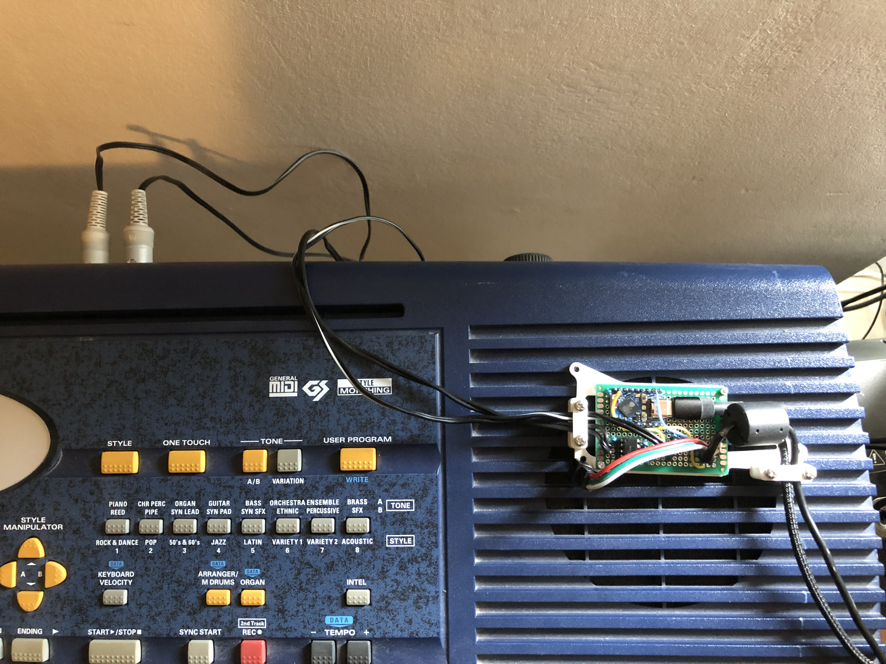
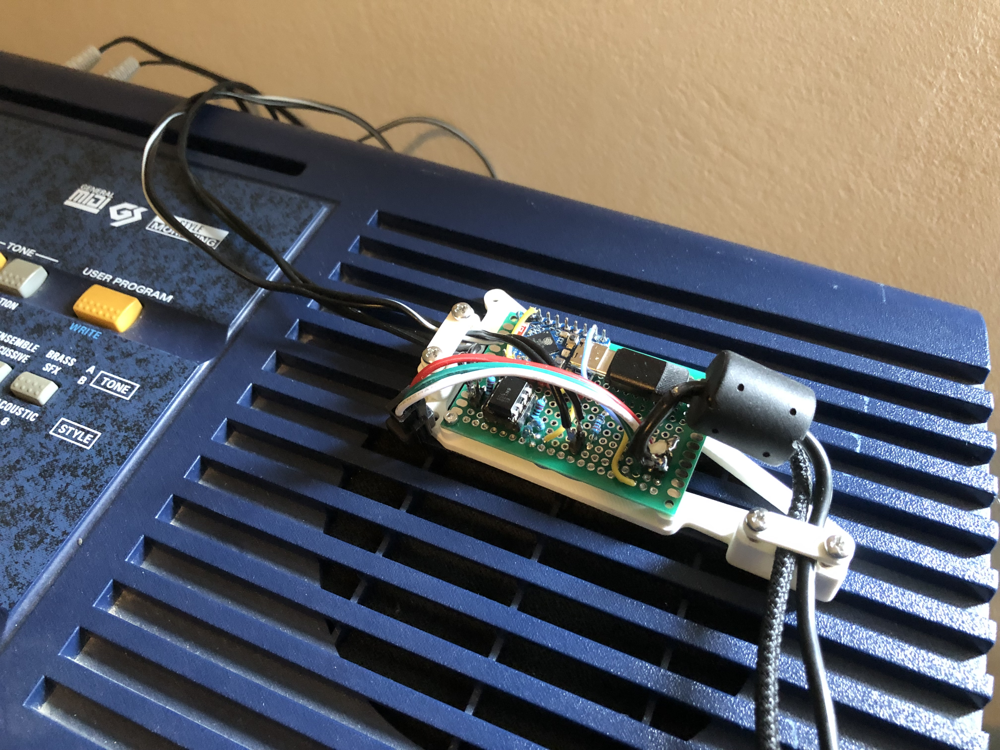

# Lamidi project; esp32-s3 midi visuals for your keyboard

A bidirectional MIDI bridge implementation for ESP32-S3 that connects USB MIDI to UART MIDI with visual color LED feedback.


<br>


A demo of the lamidi project in action can be seen : [Watch on YouTube](https://www.youtube.com/watch?v=JaErcQaUoyI)

## Features

- **Bidirectional MIDI Communication**: Seamlessly bridge between USB MIDI and UART MIDI
- **Visual Note Display**: 123 WS2812B LEDs provide colorful visual feedback for MIDI notes
- **Running Status Support**: Proper MIDI protocol implementation with running status handling
- **Real-time Processing**: Low-latency MIDI message processing using FreeRTOS tasks
- **Standard MIDI Compliance**: Supports all standard MIDI message types
- **Chromatic Color Mapping**: Each note displays in a unique color based on its chromatic position

## Hardware Requirements

### ESP32-S3 Board
- ESP32-S3 microcontroller
- USB-C connector for USB MIDI

### MIDI Interface
- **MIDI IN**: GPIO 5 (UART RX)
- **MIDI OUT**: GPIO 6 (UART TX)
- Standard MIDI DIN-5 connectors with appropriate optocoupler circuits

### LED Strip
- **LED Data Pin**: GPIO 13
- **LED Count**: 123 WS2812B addressable LEDs
- **Power Supply**: Adequate 5V supply for LED strip

## Pin Configuration

| Function | GPIO Pin | Description |
|----------|----------|-------------|
| MIDI IN  | 5        | UART RX for incoming MIDI data |
| MIDI OUT | 6        | UART TX for outgoing MIDI data |
| LED Data | 13       | WS2812B LED strip data line |

## Software Features

### MIDI Protocol Support
- **Note On/Off Messages**: Full velocity and channel support
- **Control Change**: All CC messages supported
- **Program Change**: Instrument selection support
- **Pitch Bend**: Continuous controller support
- **System Messages**: Real-time and common system messages
- **Running Status**: Optimized MIDI data transmission

### LED Visualization
- **Note Mapping**: MIDI notes 36-96 (C2-C7) mapped to keyboard positions
- **Chromatic Colors**: Each semitone displays in a unique color:
  - C: Red
  - C#: Red-Orange
  - D: Yellow
  - D#: Yellow-Green
  - E: Green
  - F: Green-Cyan
  - F#: Cyan
  - G: Cyan-Blue
  - G#: Blue
  - A: Blue-Purple
  - A#: Purple
  - B: Purple-Red

### Technical Specifications
- **MIDI Baud Rate**: 31,250 bps (standard MIDI)
- **USB Protocol**: USB MIDI Class compliant
- **Buffer Size**: 1024 bytes for UART communication
- **Task Priority**: Real-time task scheduling for low latency

## Building and Installation

### Prerequisites
- ESP-IDF v4.4 or later
- TinyUSB library
- WS2812B LED driver library

### Build Instructions
```bash
# Clone the repository
git clone <repository-url>
cd <project-directory>

# Configure the project
idf.py menuconfig

# Build the project
idf.py build

# Flash to device
idf.py -p /dev/ttyUSB0 flash monitor
```

### Configuration
The project uses standard ESP-IDF configuration. Key settings:
- USB enabled in menuconfig
- TinyUSB MIDI class enabled
- GPIO pins configured as per hardware setup

## Usage

### USB MIDI Mode
1. Connect ESP32-S3 to computer via USB-C
2. Device appears as "ESP32-S3 MIDI Bridge" in MIDI software
3. Send MIDI data from DAW/software - LEDs will visualize notes
4. MIDI data is simultaneously forwarded to UART output

### UART MIDI Mode
1. Connect MIDI device to DIN-5 MIDI IN connector
2. MIDI data received on UART is forwarded to USB
3. Visual feedback appears on LED strip
4. Compatible with hardware synthesizers, keyboards, etc.

## Code Structure

### Main Components
- **USB MIDI Handling**: TinyUSB implementation for USB MIDI class
- **UART MIDI**: Hardware UART configured for MIDI communication
- **LED Control**: WS2812B addressable LED management
- **MIDI Parsing**: Complete MIDI message parsing with running status
- **Task Management**: FreeRTOS tasks for real-time processing

### Key Functions
- `usb_to_uart_task()`: Processes USB MIDI → UART MIDI
- `uart_to_usb_task()`: Processes UART MIDI → USB MIDI
- `show_note()`: Visualizes MIDI notes on LED strip
- `get_midi_message_length()`: Determines MIDI message lengths
- `control_leds()`: Maps MIDI notes to LED positions

## Customization

### LED Configuration
```c
#define NUM_LEDS 123    // Total number of LEDs
#define LED_PIN 13      // GPIO pin for LED data
```

### MIDI Configuration
```c
#define UART_BAUD_RATE 31250  // Standard MIDI baud rate
#define UART_RX_PIN 5         // MIDI IN pin
#define UART_TX_PIN 6         // MIDI OUT pin
```

### Note Range Mapping
The current implementation maps a 61-key keyboard range (MIDI notes 36-96). Modify `midi_to_61key_position()` and `show_note()` functions to change the mapping.

## Troubleshooting

### Common Issues
1. **No USB MIDI Device**: Check USB cable and ESP-IDF USB configuration
2. **No UART MIDI**: Verify MIDI interface circuit and baud rate
3. **LED Issues**: Check power supply and LED strip connections
4. **Timing Issues**: Monitor task priorities and buffer sizes

### Debug Output
Enable logging to monitor MIDI data flow:
```c
ESP_LOGI(TAG, "USB->UART - Packet: %02X %02X %02X %02X", 
         packet[0], packet[1], packet[2], packet[3]);
```

## License

This project is licensed under the MIT License - see the SPDX header in the source file.

## Contributing

Contributions are welcome! Please:
1. Fork the repository
2. Create a feature branch
3. Submit a pull request with detailed description

## Acknowledgments

- Built with ESP-IDF framework
- Uses TinyUSB for USB MIDI implementation

- WS2812B LED control for visual feedback
